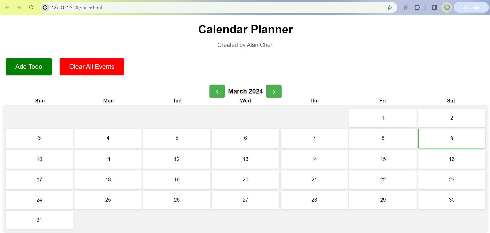
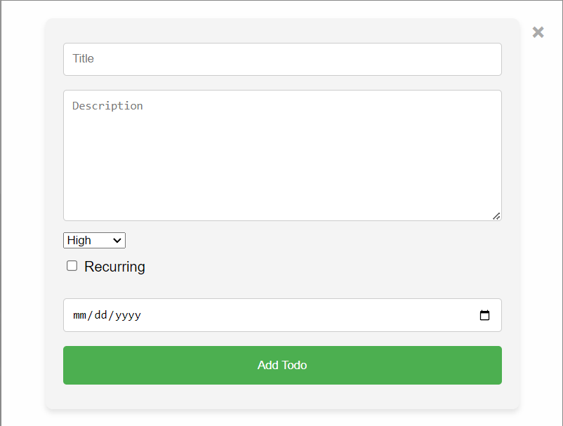
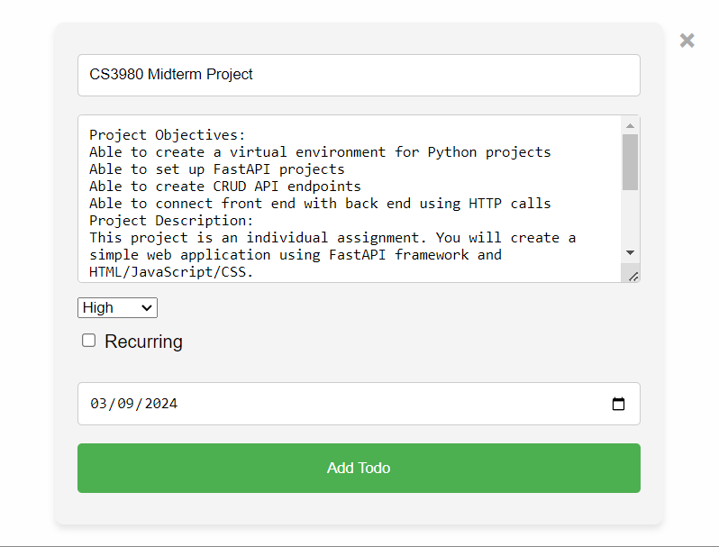
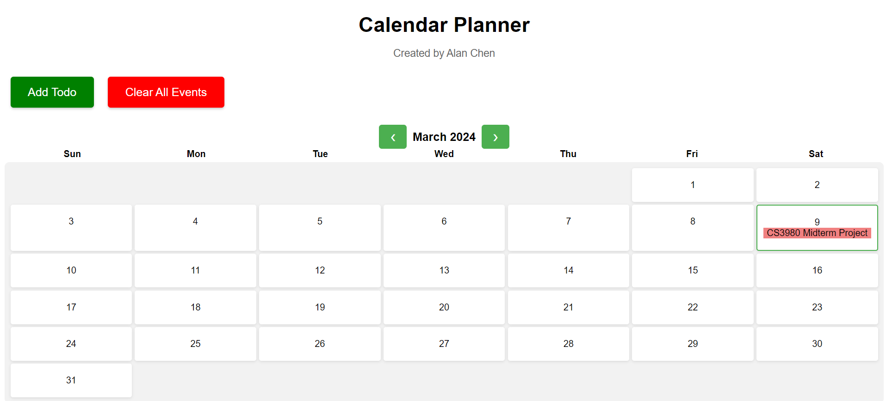
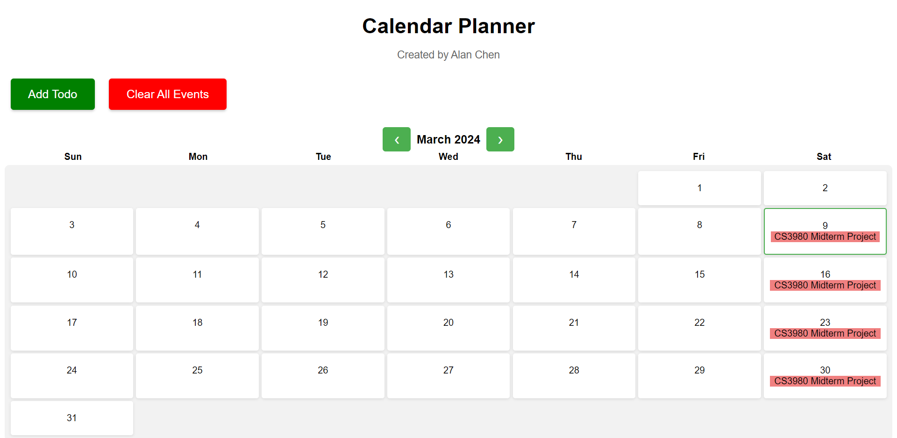

# CS-3980-Mid-term-Project
## Calendar Planner Created by Alan Chen
### 1. Python Virtual Enviroment, Pip & Uvicorn Setup

#### Setup my virtual environment and unvicorn using the following commands in my terminal:
```powershell
python -m venv venv
.\venv\Scripts\activate
```
```powershell
pip freeze > requirements.txt
pip install -r requirements.txt
```
```powershell
source venv\bin\activate
pip install fastapi uvicorn
uvicorn main:app --port 8000 --reload          
uvicorn main:app --
```
### 2.Calendar Planner App Description and Images
This calendar Planner App that I created have the function to create a new event with a title, description, priority and the option to do recurring events.
The month of the calendar is defaulted to the current month and have the option to go to pervious and next month with the buttons.
The amount of days and day of the week is correctly calculated with the equations with the use of the time module. 
Those information is than correctly displayed on the calander. 

#### Calendar with no events:


#### Empty todo form:


#### Calendar and todo form with example events:



#### Calendar with example recurring event:



