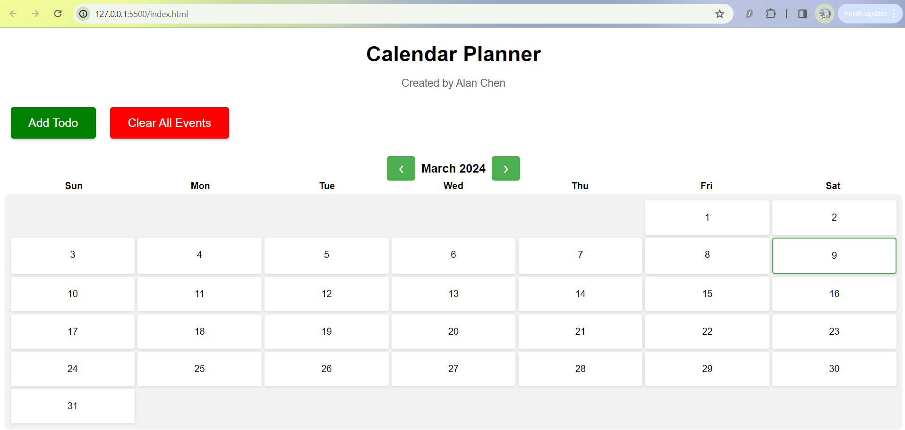
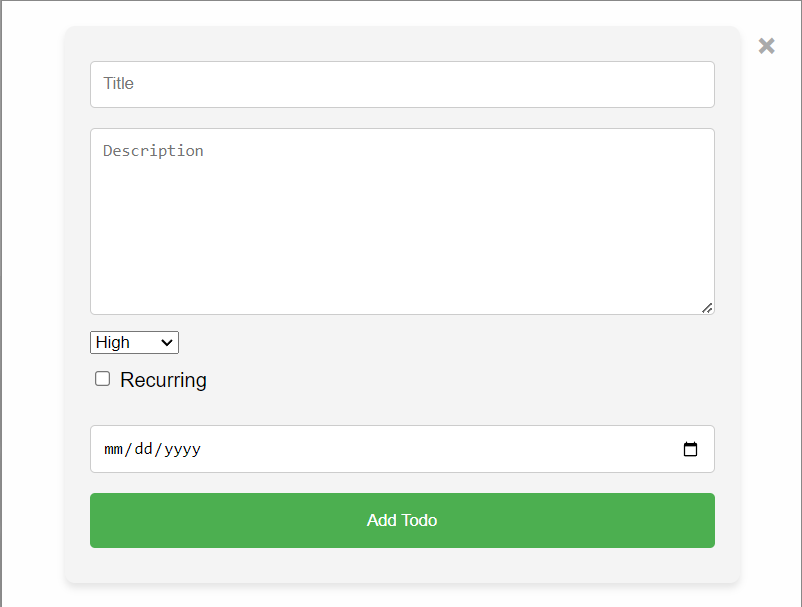
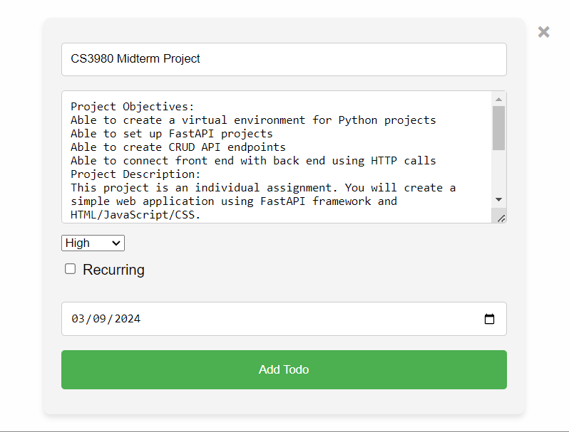
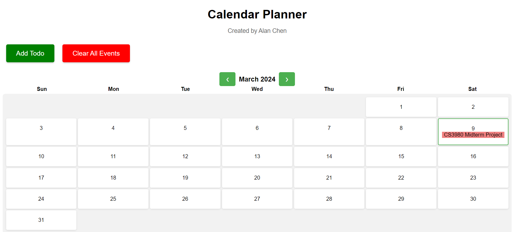

# CS-3980-Mid-term-Project
## Calendar Planner Created by Alan Chen
### Python Virtual Enviroment, Pip & Uvicorn Setup
Setup my virtual environment and unvicorn using the following commands in my terminal:
```powershell
python -m venv venv
.\venv\Scripts\activate
```
```powershell
pip freeze > requirements.txt
pip install -r requirements.txt
```
```powershell
source venv\bin\activate
pip install fastapi uvicorn
uvicorn main:app --port 8000 --reload          
uvicorn main:app --
```
### Calendar Planner App Description and Images
#### Calendar with no events:


#### Empty todo form:


#### Calendar and todo form with example events:



#### Calendar with example recurring event:
!(CalendarRe)[Example Pictures/ExampleRe.png)


